## End-to-End Architecture

Everything in one diagram: entry dispatch, daemon guards and discovery, daemon boot, IPC paths, tunnel state, foreground vs detached ownership, the 5-second grace timer, remote management, health-based daemon-loss detection, clean shutdown, and crash recovery. Red nodes are failure states; green nodes are healthy steady states.

```mermaid

flowchart TD
    %% Entry
    Entry([User invokes pinggy]) --> Parse["Parse argv<br/>src/main.ts"]
    Parse --> Mode{"Dispatch mode"}

    Mode -->|"--_daemon-child"| DCBoot
    Mode -->|"subcommand"| HandleSub["handleSubcommand<br/>src/cli/subcommand/subcommands.ts"]
    Mode -->|"legacy flags"| Legacy["buildAndStartTunnel"]

    HandleSub --> Branch{"Touches a tunnel?"}
    Legacy --> Branch
    Branch -->|"yes: start, stop, ps, attach, restart"| Guard
    Branch -->|"no: config save/list/delete/auto"| ConfigOnly["configStore<br/>tunnels/*.json"]
    ConfigOnly --> CDone([CLI exits])

    %% Daemon guards / discovery
    subgraph Guards["Daemon discovery (daemonManager.ts)"]
        direction TB
        Guard["ensureDaemonRunning"] --> Read["read daemon.json"]
        Read --> AliveQ{"PID alive?<br/>process.kill pid 0"}
        AliveQ -->|"alive"| Use["use existing daemon"]
        AliveQ -->|"dead or missing"| Clean["unlink stale<br/>daemon.json"]
        Clean --> SpawnIt["spawn detached child<br/>--_daemon-child"]
        SpawnIt --> PollIt["poll daemon.json<br/>200ms, 8s cap"]
        PollIt -->|"ready"| Use
        PollIt -->|"timeout"| FailStart([Error: daemon<br/>failed to start])
    end

    %% Daemon boot
    subgraph DaemonBoot["Daemon boot (daemonChild.ts) - runs in spawned process"]
        direction TB
        DCBoot["runDaemonChild"] --> EnsureDir["ensureConfigDir"]
        EnsureDir --> LoadCfg["load daemonConfig<br/>log level"]
        LoadCfg --> ListenIPC["ipcServer.listen<br/>127.0.0.1, OS-assigned port"]
        ListenIPC --> AtomicWrite["atomic write daemon.json<br/>tmp + rename"]
        AtomicWrite --> RestoreQ{"daemon-state.json<br/>present?"}
        RestoreQ -->|"yes, crash detected"| Replay["restoreCrashedTunnels<br/>detached only"]
        RestoreQ -->|"no, clean prior exit"| AutoCfg
        Replay --> AutoCfg["start auto-start configs"]
        AutoCfg --> Sig["install SIGTERM,<br/>SIGINT,<br/>uncaughtException handlers"]
        Sig --> Idle([Daemon idle,<br/>serving IPC])
    end

    SpawnIt -. "new process <br/>(re-execs binary with <br/> -- _daemon-child)" .->DCBoot
    AtomicWrite -. "daemon.json visible<br/>to CLI's poll loop" .-> PollIt

    %% CLI to daemon transport
    Use --> TC["TunnelClient<br/>tunnelClient.ts"]
    TC -->|"HTTP RPC"| HTTP["ipcRoutes.ts<br/>/tunnels, /tunnels/start,<br/>/start-config, /stop,<br/>/restart, /shutdown, /ping"]
    TC -->|"WebSocket"| WSP["wsProtocol.ts<br/>subscribe / unsubscribe"]
    TC -. "heartbeat" .-> Health["DaemonHealth"]

    HTTP --> Mgr["TunnelManager singleton"]
    WSP --> Sess["SessionTracker"]

    %% Tunnel state machine
    Mgr --> SDK["@pinggy/pinggy SDK<br/>TunnelInstance"]
    SDK -. "callbacks" .-> Mgr
    Mgr --> SM{"State transition"}
    SM -->|"create"| StIdle["idle"]
    SM -->|"instance.start"| StStart["starting"]
    SM -->|"established"| StRun["running"]
    SM -->|"disconnect /<br/>will_reconnect"| StRec["reconnecting"]
    StRec -->|"reconnected"| StRun
    SM -->|"stopTunnel ok"| StCls["closed"]
    SM -->|"fatal err,<br/>worker_error,<br/>reconnection_failed"| StExi([exited])

    Mgr --> Bcast["broadcast tunnel_event"]
    Bcast --> WSout["WS frames to subscribers:<br/>url_ready, stats,<br/>disconnect, reconnecting,<br/>reconnected, stopped, error"]

    %% Ownership
    Sess --> Own{"Subscription mode"}
    Own -->|"foreground"| FG["Foreground session<br/>CLI WS open"]
    Own -->|"detached (-b or remote)"| Det["Detached owner<br/>no CLI required"]

    FG --> TUI["Blessed TUI<br/>src/cli/startCli.ts"]
    Det --> Persist["stateStore<br/>writes daemon-state.json"]

    %% Foreground exit + grace
    TUI -->|"Ctrl+C / quit"| Unsub["WS unsubscribe"]
    Unsub --> RemSess["SessionTracker<br/>removes session"]
    RemSess --> Last{"last foreground<br/>session?"}
    Last -->|"no, other CLI attached"| StayUp["tunnel keeps running"]
    Last -->|"yes"| Timer["startGraceTimer<br/>(5 seconds)"]
    Timer --> Retry{"attach<br/>within 5s?"}
    Retry -->|"yes"| CancelT["cancel grace timer"]
    Retry -->|"no"| Kill([killOrphanedTunnel])
    CancelT --> FG
    Kill --> Mgr
    StayUp --> WSout

    %% Remote management
    subgraph Remote["Remote management (in CLI process)"]
        direction TB
        Cloud([Pinggy cloud WS]) --> Validate["Zod V1 / V2 schema<br/>remote_schema.ts"]
        Validate -->|"invalid"| Reject([reject + error response])
        Validate -->|"valid"| DTH["DaemonTunnelHandler<br/>daemonTunnelHandler.ts"]
    end
    DTH -. "same HTTP routes" .-> HTTP

    %% Health-based daemon loss
    Health -->|"daemon gone"| Lost["onDaemonLost fires"]
    Lost --> Exit3([CLI exits with code 3])

    %% Clean shutdown
    Idle --> ShutSig{"shutdown trigger"}
    ShutSig -->|"SIGTERM / SIGINT"| Clean2["cleanup"]
    ShutSig -->|"POST /shutdown"| Clean2
    ShutSig -->|"uncaughtException"| Clean2
    Clean2 --> R1["unlinkSync daemon.json<br/>(blocks new CLIs)"]
    R1 --> R2["clear daemon-state.json<br/>(marks clean exit)"]
    R2 --> R3["SessionTracker.destroy<br/>cancel all grace timers"]
    R3 --> R4["stop all tunnels"]
    R4 --> R5["ipcServer.close"]
    R5 --> Done([process.exit 0])

    %% Crash path
    Idle -. "process dies,<br/>no cleanup runs" .-> Dead([daemon dead<br/>daemon-state.json remains])
    Dead -. "next pinggy invocation" .-> Read

    %% Service mode entry (optional)
    Mode -.-> D["Work in progress"]
    D -.->|"daemon install-service /<br/>uninstall-service"| Svc["service installer<br/>systemd / launchd / Win SCM"]
    Svc -.-> Sys([OS spawns daemon-child<br/>at boot])
    Sys -. "same path" .-> DCBoot

    %% Styling
    classDef failure fill:#ffe5e5,stroke:#c0392b,color:#000
    classDef ok fill:#e8f6ee,stroke:#27ae60,color:#000
    classDef state fill:#eef4ff,stroke:#3a6ea5,color:#000
    class FailStart,Exit3,Lost,StExi,Dead,Reject,Kill failure
    class Done,Idle,CDone,Sys,Sig ok
    class StIdle,StStart,StRun,StRec,StCls state

```

